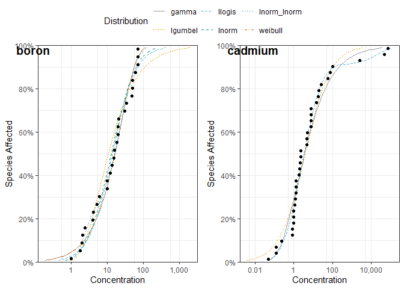
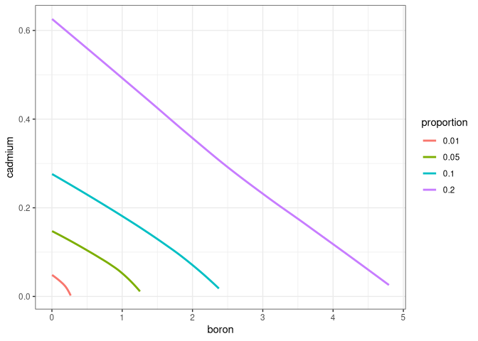

<!-- README.md is generated from README.Rmd. Please edit that file -->

# msPAF with ssdtools 

`msPAF` is an R package to obtained additive toxicity estimates based on
2 or more Species Sensitivity Distributions (SSD) obtained via
`ssdtools`.

SSDs are cumulative probability distributions which are fitted to
toxicity concentrations for different species as described by Posthuma
et al. (2001).

The current versions of msPAF takes SSDs fitted via the `ssdtools`
package, which uses Maximum Likelihood to fit distributions such as the
gamma, log-logistic, log-normal and Weibull to censored and/or weighted
data. In addition, msPAF takes concentration response curves fitted by
the package `bayesnec`, which uses Hamiltonian Monte Carlo to fit a
range of non-linear models to concentration response data using Bayesian
methods.

Joint toxicity of 2 or more contaminants and/or stressors are obtained
following the methods described in Negri, et al. 2019 (Environmental
Science and Technology, 54(2), pp.1102-1110).

## Installation

To install the latest version of `ssdtools` from
[CRAN](https://CRAN.R-project.org/package=ssdtools)

``` r
install.packages("ssdtools")
```

To install the latest development version of `msPAF` from
[GitHub](https://github.com/open-AIMS/msPAF)

``` r
if (!requireNamespace("remotes")) {
  install.packages("remotes")
}
remotes::install_github("open-aims/msPAF", ref = "main")
```

## Introduction

`ssdtools` accesses examples SSD data from the
[ssddata](https://CRAN.R-project.org/package=ssddata) package for a
range of chemicals. We will use the Boron and Cadmium datasets here as a
two component mixture example.

``` r
library(ssdtools)
ssddata::ccme_boron
#> # A tibble: 28 × 5
#>    Chemical Species                  Conc Group        Units
#>    <chr>    <chr>                   <dbl> <fct>        <chr>
#>  1 Boron    Oncorhynchus mykiss       2.1 Fish         mg/L 
#>  2 Boron    Ictalurus punctatus       2.4 Fish         mg/L 
#>  3 Boron    Micropterus salmoides     4.1 Fish         mg/L 
#>  4 Boron    Brachydanio rerio        10   Fish         mg/L 
#>  5 Boron    Carassius auratus        15.6 Fish         mg/L 
#>  6 Boron    Pimephales promelas      18.3 Fish         mg/L 
#>  7 Boron    Daphnia magna             6   Invertebrate mg/L 
#>  8 Boron    Opercularia bimarginata  10   Invertebrate mg/L 
#>  9 Boron    Ceriodaphnia dubia       13.4 Invertebrate mg/L 
#> 10 Boron    Entosiphon sulcatum      15   Invertebrate mg/L 
#> # ℹ 18 more rows
ssddata::ccme_cadmium
#> # A tibble: 36 × 5
#>    Chemical Species                   Conc Group Units
#>    <chr>    <chr>                    <dbl> <fct> <chr>
#>  1 Cadmium  Oncorhynchus mykiss       0.23 Fish  ug/L 
#>  2 Cadmium  Salvelinus confluentus    0.83 Fish  ug/L 
#>  3 Cadmium  Cottus bairdi             0.96 Fish  ug/L 
#>  4 Cadmium  Salmo salar               0.99 Fish  ug/L 
#>  5 Cadmium  Acipenser transmontanus   1.14 Fish  ug/L 
#>  6 Cadmium  Prosopium williamsoni     1.25 Fish  ug/L 
#>  7 Cadmium  Salmo trutta              1.36 Fish  ug/L 
#>  8 Cadmium  Salvelinus fontinalis     2.23 Fish  ug/L 
#>  9 Cadmium  Oncorhynchus tshawytscha  2.29 Fish  ug/L 
#> 10 Cadmium  Pimephales promelas       2.36 Fish  ug/L 
#> # ℹ 26 more rows
```

We start by fitting the default `ssdtools` distributions are fit using
`ssd_fit_dists()`, to create a named list of `ssdtools` `fitdists`
objects for the chemicals for which we want to explore additive
toxicity.

``` r
fits <- list(boron = ssd_fit_dists(ssddata::ccme_boron), 
             cadmium = ssd_fit_dists(ssddata::ccme_cadmium))
             
```

The resulting fitted distributions can be quickly plotted using
`autoplot`

``` r
library(ggplot2)
library(ggpubr)

theme_set(theme_bw())

plot_list <- lapply(fits, FUN = function(p){
  autoplot(p) +
    scale_colour_ssd()  
})

ggarrange(plotlist = plot_list, common.legend = TRUE, labels = names(plot_list))
```

<!-- --> We can obtain
predictions of the additive proportion of species affected across both
chemicals using

``` r
library(msPAF)
plot_dat <- additive_predict(fits)
head(plot_dat)
#>       boron    cadmium additive_proportions
#> 1 0.2672578 0.04869861               0.0199
#> 2 0.5310847 0.04869861               0.0298
#> 3 0.7829869 0.04869861               0.0397
#> 4 1.0239697 0.04869861               0.0496
#> 5 1.2567784 0.04869861               0.0595
#> 6 1.4843001 0.04869861               0.0694
```

For two contaminants, these can be visualized as a surface.

``` r
library(plotly)
z=plot_dat$additive_proportions
y=plot_dat$boron
x=plot_dat$cadmium
dat <- data.frame(z,y,x)
plot_ly(z = ~xtabs(z ~ x + y), data = dat) |> 
  add_surface() 
```

The model-averaged additive 1, 5, 10 and 20% hazard concentration can be
estimated via `additive_hc`. Note that for two contaminants, these form
a curve.

``` r
hc_vals_out <- additive_hc(fits)
hc_vals_out
#> # A tibble: 720 × 4
#>    boron  cadmium additive_proportions proportion
#>    <dbl>    <dbl>                <dbl> <fct>     
#>  1 0.267 0.000637               0.0101 0.01      
#>  2 0.264 0.00185                0.0101 0.01      
#>  3 0.261 0.00320                0.0101 0.01      
#>  4 0.258 0.00454                0.0101 0.01      
#>  5 0.255 0.00583                0.0101 0.01      
#>  6 0.252 0.00705                0.0101 0.01      
#>  7 0.249 0.00820                0.0101 0.01      
#>  8 0.246 0.00928                0.0101 0.01      
#>  9 0.243 0.0103                 0.0101 0.01      
#> 10 0.240 0.0113                 0.0101 0.01      
#> # ℹ 710 more rows
```

For only two contaminants, these co-dependence curves can easily be
visualized.

``` r
hc_vals_out |> 
  ggplot(aes(x=boron, y=cadmium, colour = proportion)) +
  geom_smooth(se=FALSE) +
  theme_bw()
#> `geom_smooth()` using method = 'loess' and formula = 'y ~ x'
```

<!-- --> The model-averaged
additive hazard proportion values can be obtained via `additive_hp` by
providing the list of fitted SSDs and a named list of concentrations for
each contaminant.

``` r
hp_vals_out <- additive_hp(fits, 
                           fixed_conc = list(boron = c(1, 5, 10), 
                                       cadmium = c(0.1, 0.2)))
hp_vals_out
```

## Further Information

`bayesnec` is provided by the [Australian Institute of Marine
Science](https://www.aims.gov.au/) under the GPL-2 License
([GPL-2](https://opensource.org/license/gpl-2-0)).
